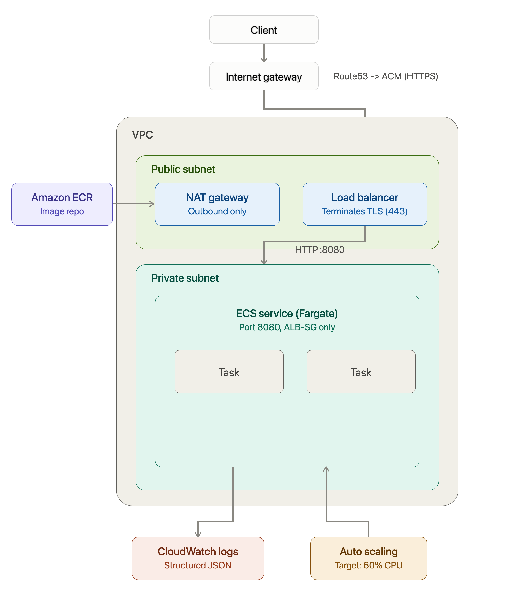

# Finzla Cloud & Platform Engineering Assessment

A minimal FastAPI service deployed to AWS ECS Fargate via Terraform and GitHub Actions.

## Contents

- [Architecture](#architecture)
- [Request path](#request-path-internet---aws---application)
- [Terraform structure](#terraform-structure)
- [Managing state, environments, and access without AdministratorAccess](#managing-state-environments-and-access-without-administratoraccess)
- [CI/CD pipeline](#cicd-pipeline)
- [Who can deploy to production?](#who-can-deploy-to-production)
- [Security & the most sensitive IAM role](#security--the-most-sensitive-iam-role)
- [Monitoring](#monitoring)
- [Logs](#logs)
- [Incident investigation exercise](#incident-investigation-exercise)
- [Engineering judgement](#engineering-judgement)
- [Local development](#local-development)
- [Running this locally / what's verified vs. not](#running-this-locally--whats-verified-vs-not)

---

## Architecture



**Chosen: ECS on Fargate**, behind an internet-facing Application Load Balancer, across
two (dev) or three (prod) AZs.

**Why:** the brief explicitly says "a smaller, secure, well-understood solution scores
higher than an unnecessarily complex one." For a single small stateless HTTP service:

- Fargate removes EC2/node-group patching, AMI management, and cluster-autoscaler tuning
  entirely - there is no host OS to secure or upgrade.
- ECS's native deployment circuit breaker (automatic rollback on failed health checks) and
  its tight IAM/task-definition model map directly onto the assessment's requirements
  (health checks, rollback, least-privilege roles) with very little glue code.
- The blast radius of a compromised task role is naturally scoped to one ECS
  task/service, without needing Kubernetes RBAC, network policies, or admission
  controllers layered on top to get the same isolation.

**Rejected alternative: EKS.** Kubernetes is the right call once there are many
services, a platform team to run it, or a real need for portability across clouds.
Here it would mean standing up and securing a control plane, node groups (or Fargate
profiles anyway), RBAC, an ingress controller, and probably a service mesh - all to run
one `/health` endpoint. That's the "unnecessarily complex architecture" the brief warns
against, and it would also take meaningfully longer to get right in the time available.

The application container itself is **never** given a public IP or exposed to the
internet directly - see [Request path](#request-path-internet---aws---application).

### Request path: Internet -> AWS -> Application

1. A client resolves `finzla-dev.dglidestcl.com` via a **Route53 ALIAS record**
   (`terraform/modules/dns`) pointing at the ALB, and connects over **HTTPS (443)**.
   The record is created and torn down by Terraform along with everything else - no
   manual DNS step. (An ALIAS rather than a CNAME: free to query, no TTL to manage, and
   `evaluate_target_health = true` means Route53 stops answering with this record if
   the ALB itself is reporting unhealthy.)
2. The **Application Load Balancer** sits in the **public subnets** and is the only
   resource that accepts *inbound* application traffic from the public internet - it
   terminates TLS using an ACM certificate (`ELBSecurityPolicy-TLS13-1-2-2021-06`), and
   its security group only accepts 443 (and 80, solely to 301-redirect to 443). (The
   NAT Gateway in the public subnet, below, also has a public Elastic IP - but only for
   *outbound* connectivity from the private subnet; it provides no inbound path.)
3. The ALB forwards the decrypted request over plain HTTP to a **target group** of
   **ECS Fargate tasks**, using their private `awsvpc` ENI IPs (`target_type = ip`).
4. Each ECS task runs in a **private subnet**, has **no public IP**, and its security
   group's only ingress rule is "port 8080 from the ALB's security group" - not a CIDR
   range, the security group ID itself - so nothing else in the VPC can reach it via a
   security-group-permitted path, even if it ended up on the same subnet.
5. Outbound from the private subnet (pulling the image from ECR, calling AWS APIs,
   shipping logs) goes through a **NAT Gateway** in the public subnet. There is no
   inbound path through the NAT gateway.
6. The container returns the response, which flows back through the ALB to the client.

## Terraform structure

```
terraform/
  modules/
    vpc/          VPC, public+private subnets, IGW, NAT, route tables
    ecr/          Image repository, scan-on-push, lifecycle policy
    alb/          ALB, target group, HTTP->HTTPS redirect, HTTPS listener
    dns/          Route53 ALIAS record pointing a hostname at the ALB
    iam/          ECS task/execution roles + scoped GitHub OIDC roles (CI plan + app deploy)
    ecs/          Cluster, task definition, service, autoscaling
    monitoring/   Log group, SNS topic, CloudWatch alarms
  environments/
    dev/          Root module wiring the above for dev (1-2 AZ, single NAT, smaller)
    prod/         Same modules, different sizing (3 AZ, NAT per AZ, more capacity)
  bootstrap/       One-time, human-run foundation: S3 state buckets, DynamoDB lock
                   tables, the GitHub OIDC provider, and the terraform_apply roles
                   that let CI create/update/destroy everything else
```

Design choices worth calling out:

- **Environment separation** is directory-based (`environments/dev`, `environments/prod`),
  each with its **own state file, own S3 bucket, and own DynamoDB lock table** - not
  Terraform workspaces sharing one bucket. A mistake in dev tooling or a leaked dev
  credential can never touch prod state. The two environments only share code via the
  `modules/` directory.
- **No hard-coded credentials anywhere.** The AWS provider uses the ambient credentials
  from GitHub's OIDC-assumed role (or a human's SSO session locally) - never an access
  key in a variable or `.tfvars` file.
- **Naming** follows `<project>-<environment>-<resource>` throughout (`finzla-dev-alb`,
  `finzla-prod-cluster`) so any resource in the AWS console is traceable to this repo
  and environment at a glance.
- **Minimal duplication**: all environment-specific difference (subnet counts, NAT
  strategy, instance sizing, log retention) is expressed as module *input variables*,
  not by forking module code between dev and prod.

### Managing state, environments, and access without AdministratorAccess

1. **Remote Terraform state** - an S3 bucket per environment
   (`finzla-terraform-state-{dev,prod}`), versioned and SSE-KMS encrypted, all public
   access blocked. Created once via `terraform/bootstrap`, run manually by a platform
   engineer using a scoped "bootstrap" permission set (S3/DynamoDB/KMS/IAM create only) -
   not `AdministratorAccess`, and not part of the automated pipeline.
2. **State locking / concurrent changes** - a DynamoDB table per environment
   (`finzla-terraform-locks-{dev,prod}`) providing state locking via the S3 backend's
   `dynamodb_table` parameter: `terraform apply` acquires a lock item before writing
   state and releases it after, so two concurrent applies against the same environment
   fail fast instead of corrupting state. (Newer Terraform versions support S3-native
   locking via `use_lockfile`, without a separate DynamoDB table - this project
   predates that becoming the default recommendation and still uses the DynamoDB
   approach; migrating is a reasonable future simplification, not a correctness issue
   today.)
3. **Dev and prod separation** - entirely separate root modules, state files, and
   separate scoped IAM roles per environment, so a role that can touch dev can never
   touch prod, by construction of its trust policy - not by convention.
4. **No AdministratorAccess anywhere in automation.** Every role GitHub Actions can
   assume - `github_ci` (read-only PR plans), `github_deploy` (app image/ECS update
   only), and `terraform_apply` (infrastructure changes - see below) - is built from
   an explicit `aws_iam_policy_document` listing only the actions needed for its job,
   never a managed admin-style policy. `github_ci` and `terraform_apply` both live in
   `terraform/bootstrap` rather than in the per-environment `iam` module - not
   arbitrarily, but because either one being created *by* an environment's own
   Terraform would be circular: `github_ci` has to exist to pass the PR check *before*
   a PR merges, but an environment's Terraform (and any role it creates) only gets
   applied *after* merge. Bootstrap being the one thing a human applies first is what
   breaks that cycle for both roles. The one deliberately manual step is
   `terraform/bootstrap` itself: a human runs it once, using their own scoped
   permissions, to create the OIDC provider and the `terraform_apply` roles - because a
   CI role can't be the thing that creates the very first CI role it would need to run
   (see [CI/CD pipeline](#cicd-pipeline)).

### Who can change infrastructure?

Infrastructure changes (`terraform/**`) go through `.github/workflows/infra.yml`,
using the `terraform_apply` roles from `terraform/bootstrap` - **not**
`github_deploy`, which is deliberately incapable of touching IAM/VPC/ALB at all. The
same layered model as application deploys, but with its own approval boundary:

1. **PR validation** (`pr-validation.yml`) already runs `terraform plan` against dev
   using the read-only `github_ci` role and posts it as a PR comment - every infra
   change is reviewed *before* merge.
2. **Dev infra applies automatically** on merge to `master` (job `apply-dev`, GitHub
   Environment `infra-dev`), using the exact plan just generated in that same job -
   never a second, potentially-different plan.
3. **Prod infra requires approval**: `plan-prod` runs unblocked (so its output is
   visible in the job log before anyone approves anything) and uploads the plan as an
   artifact; `apply-prod` is gated behind the `infra-prod` GitHub Environment's
   required reviewers and applies that *exact* uploaded plan artifact, not a fresh one.
4. **`infra-dev`/`infra-prod` are separate GitHub Environments from `development`/
   `production`** (used by app deploys). That split means infrastructure approvers and
   application-deploy approvers can be different people/teams, which matters once a
   platform team and an app team aren't the same people.

**`infra.yml` and `deploy.yml` are deliberately fully independent** - each triggers
only on its own path filter (`terraform/**` vs `app/**`/`Dockerfile`), with no
cross-workflow dependency between them. An earlier version of this pipeline chained
`deploy.yml` to wait for `infra.yml`'s completion (via a `workflow_run` trigger), on
the reasoning that an app should never deploy on top of unverified infra. On
reflection, that traded a real but modest safety gain for meaningful complexity
(`workflow_run`'s SHA-pinning caveats, a run that no longer shows up as a normal PR
status check, harder-to-debug cross-workflow state) and slower CI on every app-only
change (a full `terraform plan`/`apply` just to keep the chain reliable) - exactly the
kind of complexity the brief's "a smaller, secure, well-understood solution scores
higher" guidance argues against, for a guarantee this project's scale doesn't need
day-to-day.

**What actually keeps the two pipelines from racing each other is a PR convention,
not code**: keep infrastructure PRs and application PRs separate, especially for the
very first deployment. Concretely:

- **Infrastructure changes**: open a PR touching only `terraform/**` -> PR validation
  passes -> merge -> `infra.yml` applies dev, then (after approval) prod -> confirm
  infra is healthy before merging anything that depends on it.
- **Application changes**: open a PR touching only `app/**`/`Dockerfile` -> PR
  validation passes -> merge -> `deploy.yml` builds/pushes/deploys - and does **not**
  touch Terraform at all, whether or not infrastructure already exists.
- A PR that touches both `terraform/**` and `app/**` will trigger both workflows in
  parallel on merge - worth avoiding, particularly for the very first deployment where
  `deploy.yml` would otherwise be racing to deploy into infrastructure `infra.yml`
  hasn't finished creating yet.

This is also worth being explicit about what the pipeline *doesn't* automate:
**`terraform destroy` stays manual**, run locally by a human. Automating irreversible
deletion of infrastructure behind the same "push to master" trigger as everything else
is a materially different risk than automating creation/updates, and isn't justified by
anything this assessment asks for.


**`pr-validation.yml`** (on pull request):
`terraform fmt -check` -> `terraform validate` -> `terraform plan` (posted as a PR
comment, using a **read-only** OIDC role) -> `tfsec` IaC scan -> Python lint (`ruff`) +
unit tests (`pytest`) -> Docker build -> Trivy image vulnerability scan (fails the check
on CRITICAL/HIGH).

**`deploy.yml`** (on push to `master`, i.e. after merge):

```
build-and-push  ->  deploy-dev (auto)  ->  deploy-prod (requires approval)
                        |                         |
                   health check              health check
```

1. **Build** the image once, tag it with the git SHA (`sha-<12 chars>`), push to ECR.
2. **Deploy to dev** automatically via a small composite action
   (`.github/actions/ecs-deploy`) that renders a new task definition revision pointing
   at the new image tag, calls `ecs update-service --force-new-deployment`, and waits
   (`aws ecs wait services-stable`) for the rollout to finish.
3. **Confirm health**: the workflow polls `GET /health` through the ALB (not the task
   directly) for up to ~2.5 minutes, so it's testing the same path a real customer
   would use.
4. **Handle an unhealthy deployment**: two layers -
   - *In infrastructure*: the ECS service has `deployment_circuit_breaker { enable =
     true, rollback = true }` (Terraform, `modules/ecs`). If new tasks fail their own
     health checks, ECS itself stops the rollout and rolls back to the last healthy
     task definition - no human or pipeline action required.
   - *In the pipeline*: if the `/health` polling loop still doesn't see a 200 (e.g. the
     ALB target group hasn't caught up yet, or the rollback itself is unhealthy), the
     job fails loudly, and `deploy-prod` never runs because it `needs: [..., deploy-dev]`.
5. The **same immutable image tag** that passed dev is promoted to prod - prod never
   rebuilds from source, so "what's running in prod" is always traceable to one build.
   (Precisely: this is tag-based, not digest-based, promotion - `finzla-dev-app:sha-
   <commit>`, not a `@sha256:...` reference. ECR's `image_tag_mutability = "IMMUTABLE"`
   means that specific tag can never be repointed at different image content once
   pushed, which gives the same practical guarantee - but it's worth being precise
   that the mechanism is an immutable tag, not a digest pin.)

**Deployment traceability**: the Docker image itself is generic - it contains no
`APP_ENV`, `APP_VERSION`, `BUILD_NUMBER`, or `GIT_COMMIT` at all. `.github/actions/ecs-deploy`
writes those four directly into the ECS task definition's environment block at deploy
time (from the image tag, `github.run_number`, and `github.sha`), which is also why the
same immutable tag can be promoted from dev to prod unchanged - only the task
definition differs per environment, never the image. `GET /version` on a running task
therefore always reflects exactly what GitHub Actions deployed, which is what you'd
actually check first during the technical review or a real incident (`git commit ->
GitHub Actions -> generic image -> ECR -> ECS task definition (APP_ENV, APP_VERSION,
BUILD_NUMBER, GIT_COMMIT) -> GET /version`).

None of those four values, and no permanent AWS credentials, ever go into GitHub
Secrets - they're not secrets, and GitHub -> AWS auth is entirely OIDC-based (see
[Security](#security--the-most-sensitive-iam-role)). The only things stored as GitHub
secrets are role ARNs (`AWS_CI_ROLE_ARN`, `AWS_DEPLOY_ROLE_ARN_DEV`,
`AWS_DEPLOY_ROLE_ARN_PROD`, `AWS_TERRAFORM_APPLY_ROLE_ARN_DEV`,
`AWS_TERRAFORM_APPLY_ROLE_ARN_PROD`), which aren't sensitive either - they're only
usable at all by a workflow run whose OIDC token matches that specific role's trust
policy.

**`infra.yml`** (on push to `master`, only when `terraform/**` changes) - see
[Who can change infrastructure?](#who-can-change-infrastructure) above for the full
picture; in short: `apply-dev` (auto) -> `plan-prod` (unblocked, so its output is
readable before anyone approves) -> `apply-prod` (gated behind `infra-prod`'s required
reviewers, applies the exact plan artifact `plan-prod` produced). This is entirely
separate from `deploy.yml` and uses the `terraform_apply` roles from
`terraform/bootstrap`, not `github_deploy` - the two pipelines can't be confused with
each other because they use different identities with different, non-overlapping
permissions.

### Who can deploy to production?

Three independent layers all have to hold at once, not just one:

1. **OIDC trust condition**: the prod deploy role's trust policy only accepts tokens
   whose `sub` claim is exactly
   `repo:<org>/finzla-platform:environment:production`. A token from any other repo,
   any other GitHub org, a fork, or even this same repo but *without* the job declaring
   `environment: production`, is rejected by AWS at `AssumeRoleWithWebIdentity` time -
   before any IAM policy is even evaluated.
2. **GitHub Environment protection rules**: the `production` GitHub Environment is
   configured with required reviewers. The `deploy-prod` job in the workflow literally
   does not start running until someone with permission clicks approve - GitHub blocks
   the job, not just the AWS call.
3. **IAM policy scoping**: even a correctly-authenticated prod deploy role can only push
   to one named ECR repository, update one named ECS service/cluster, and `PassRole`
   exactly two task roles (condition-scoped to `ecs-tasks.amazonaws.com`). It cannot
   touch IAM, networking, or any other service.

So: a compromised workflow in a *different* repo fails at (1). A compromised individual
developer's laptop/PAT without reviewer rights fails at (2). A compromised or malicious
PR merged into *this* repo's `master` still requires (2)'s human approval to reach prod, and
even then is limited by (3) to "deploy a container," not "do anything in the account."

## Security & the most sensitive IAM role

**Most security-sensitive role: `terraform_apply` (prod) - the infra-apply role from
`terraform/bootstrap`.** Not `github_deploy` - see why below.

- **What it can do**: create, modify, and delete almost everything this stack touches -
  VPC/subnets/NAT/security groups, ALB/target groups, ECS clusters/services/task
  definitions, ECR repositories, Route53 records, CloudWatch alarms/SNS topics, and -
  the sensitive part - **IAM roles and policies**, scoped to the `finzla-*` naming
  prefix (see `terraform/bootstrap/iam-ci.tf` for the full policy).
- **Why those permissions are required**: Terraform has to be able to create and change
  every resource type it manages, including the IAM roles those resources assume (task
  execution role, task role) and the sibling CI roles (`github_ci`, `github_deploy`)
  that this same project's pipeline depends on. There's no way to run
  Terraform-manages-its-own-IAM without the apply identity having IAM write access.
- **What could happen if it were compromised**: this is the most severe outcome in the
  account - an attacker could rewrite any `finzla-*` IAM role's trust policy (including
  loosening `github_deploy`'s trust condition to accept tokens from an attacker-controlled
  repo), open the ALB security group to a wider path, or point the ECS service at a
  different image entirely. In practice this subsumes everything `github_deploy` could
  do, plus persistence via IAM changes.
- **What limits its blast radius**:
  - **IAM actions are hard-scoped to the `finzla-*` resource-name prefix** - this role
    cannot touch any IAM role, policy, or OIDC provider outside this project, even
    though it has broad IAM verbs. It cannot grant itself `AdministratorAccess` or
    create an unrelated backdoor role, because every IAM statement's `Resource` element
    rejects any ARN not matching that prefix.
  - **Not a standing credential** - same OIDC mechanism as the app deploy roles: it only
    exists for the duration of a single GitHub Actions job, and only when the token's
    `sub` claim matches `repo:<org>/<repo>:environment:infra-{dev,prod}` exactly.
  - **`infra-prod` requires GitHub Environment reviewer approval**, and critically, the
    approver can read the *exact* `terraform plan` output (uploaded as a build artifact
    by the preceding `plan-prod` job) before approving - not just a "trust the diff"
    button. `apply-prod` then applies that literal plan artifact, not a fresh one, so
    what gets approved is what gets applied.
  - **Every change is reviewed twice before it ever reaches this role**: once at PR time
    (`terraform plan` posted as a PR comment, using the separate read-only `github_ci`
    role) and again at merge time (the `infra-{dev,prod}` gate above).
  - It genuinely **cannot fully eliminate the self-escalation risk** inherent to any
    setup where Terraform manages its own CI identity - a sufficiently sophisticated
    attacker who reached this role could still, in principle, modify the `finzla-*`
    roles it's scoped to. What the controls above do is make reaching this role hard
    (two review gates, narrow OIDC trust, no standing credential) and make what it can
    reach narrow (this project's own resources, nothing else in the account).

**Second tier: `github_deploy` (prod)** - narrower and reached far more often (every
merge to `master` that touches `app/**`, vs. only `terraform/**` changes for the apply
role):
- Can only push to one named ECR repository, update one named ECS service/cluster, and
  `PassRole` exactly two task roles (condition-scoped to `ecs-tasks.amazonaws.com`). It
  **cannot** touch IAM, networking, or any other service - deliberately excluded so
  that the much-more-frequent app-deploy path has a meaningfully smaller blast radius
  than the much-rarer infra-apply path.
- If compromised: an attacker could deploy an arbitrary container image into
  production - serious (arbitrary code execution in prod tasks), but bounded to what
  the *task role* it passes can reach at runtime, which has no custom permissions of
  its own by default.
- Gated behind the `production` GitHub Environment's required reviewers, same mechanism
  as `infra-prod` above but a separate approval boundary (see
  [Who can change infrastructure?](#who-can-change-infrastructure) for why they're kept
  separate).

Other security measures throughout the stack: security groups follow least-access (ALB:
443/80 from the internet only; tasks: container port from the ALB SG only, nothing
else); HTTPS/TLS terminates at the ALB with a modern TLS policy; ECR images are
KMS-encrypted at rest and scanned on push; CloudWatch log group and S3 state buckets are
encrypted; no secrets exist in source, task definitions, or Terraform state (the app
takes none today - if it needed one, it would come from Secrets Manager/SSM referenced
by ARN in the task definition's `secrets` block, never a plain env var); dev and prod
are fully separate trust boundaries end-to-end (separate VPCs, separate IAM roles,
separate state).

**Image-level hardening** (`Dockerfile`): multi-stage build, so build-only tooling
(the venv build step) never ships in the runtime image; runs as a dedicated non-root
`app` user (`USER app`) rather than root; contains no AWS credentials or application
secrets of any kind; and - as covered above - contains no deployment metadata either,
so the same immutable image tag is what actually gets scanned, tested, and promoted
unchanged from dev to prod - tagged (`sha-<commit>`), not pinned by SHA-256 digest, and
the ECR repository's `IMMUTABLE` tag-mutability setting is what makes that tag a
reliable, un-overwritable reference in practice. The container-level `HEALTHCHECK` and the ALB target group's health
check are deliberately both present because they answer different questions: the
former is "is the process alive," the latter is "can the load balancer actually reach
it" - the [incident investigation exercise](#incident-investigation-exercise) below is
precisely a case where those two can disagree.

## Monitoring

**Metrics tracked** (CloudWatch, `modules/monitoring`):

| Metric | Source | Used for |
|---|---|---|
| `HTTPCode_Target_5XX_Count` | ALB target group | Application error rate |
| `UnHealthyHostCount` | ALB target group | Is the ALB currently routing to broken tasks |
| `RunningTaskCount` | ECS Container Insights | Capacity / crash-looping detection |
| `CPUUtilization` | ECS service | Capacity planning, autoscaling signal |
| (dashboarded, not alarmed) request latency, memory utilization | ALB / ECS | Investigation context during an incident |

**Alerts** (SNS -> email):

1. **`finzla-{env}-target-5xx-rate`** — triggers on >5 target-origin 5xx responses in a
   3-minute window (2 of 3 datapoints breaching). Matters because it's the most direct
   "customers are seeing errors right now" signal. Goes to the on-call platform
   engineer; first investigation step is `aws logs tail /ecs/finzla-{env} --follow` filtered
   to the affected time window, cross-referenced with the ECS service's recent
   deployment events.
2. **`finzla-{env}-unhealthy-targets`** — triggers the moment `UnHealthyHostCount > 0`
   (2 consecutive 1-minute datapoints). Matters because it's the earliest reliable
   signal of a bad deploy or a resource exhaustion issue, often *before* customer-facing
   5xx volume is high. Goes to the on-call platform engineer; first investigation step
   is `aws ecs describe-services` to see recent deployment/event history, then check the
   target group's health check reason via `aws elbv2 describe-target-health`.

(A third, `running-task-count-low`, and a fourth, `high-cpu`, are also implemented -
the first as a hard capacity-loss backstop, the second as a non-urgent scaling signal -
see `modules/monitoring/main.tf` for full detail on all four.)

## Logs

Application logs are written as structured JSON to stdout/stderr only (never to a file,
never containing secrets - see `app/main.py`'s `JsonFormatter`). The ECS `awslogs` log
driver ships them to CloudWatch Logs, group `/ecs/finzla-{dev,prod}`, stream prefix
`app`. **Retention: 14 days in dev, 90 days in prod** - long enough in prod to support a
post-incident review weeks later without indefinitely accumulating (and paying for)
logs for a low-traffic assessment service.

## Incident investigation exercise

> GitHub Actions reports "Deployment successful", ECS reports expected tasks running,
> but customers get HTTP 503 and the ALB reports unhealthy targets.

**1. What I'd investigate first**: the gap between "ECS says tasks are running" and "ALB
says targets are unhealthy" - that gap is almost always the target group's health check
failing against a task that *did* start. So: pull the target group's health check
failure reason first, before anything else.

**2. Services/logs/metrics I'd inspect**:
- `aws elbv2 describe-target-health --target-group-arn <arn>` - gives the exact reason
  per target (`Target.FailedHealthChecks`, `Target.Timeout`, `Target.ResponseCodeMismatch`, etc.)
- `aws ecs describe-services` + `describe-tasks` - container-level exit codes, "stopped
  reason," and whether tasks are actually cycling (started, failed, restarted) rather
  than staying up.
- CloudWatch Logs (`/ecs/finzla-{env}`) for the exact deployment window - is the app
  crashing on startup, throwing on `/health`, or just not listening on the expected
  port?
- The ALB target group's configured health check path/port vs. what the new task
  definition actually exposes.
- Security group changes in the same deploy (did a Terraform change to the task SG or
  ALB SG land in the same window?).

**3. At least three possible causes, and how to prove/eliminate each**:

- **Health check path/port mismatch** (e.g. a Terraform or task-definition change moved
  the container port or the health check path changed) - *prove*: compare the target
  group's configured `HealthCheckPath`/`Port` against the task's actual `portMappings`
  and the app's real health route; a mismatch is immediately visible.
- **Security group regression** (ALB -> task ingress rule accidentally narrowed or
  removed in the same change) - *prove*: `Target.Timeout` in `describe-target-health`
  (not a 4xx/5xx - a connection-level timeout) combined with the task SG's ingress
  rules failing to match the ALB SG. A response-code mismatch points elsewhere; a
  timeout points here.
- **App crash-looping under the new image** (bad env var, missing dependency,
  unhandled startup exception) - *prove*: `describe-tasks` shows a `stoppedReason` /
  non-zero exit code, and CloudWatch Logs show a stack trace or the container never
  logging its "ready" line before exiting.
- **Health check too aggressive for a slow-starting app** (grace period too short) -
  *prove*: tasks pass health checks briefly then flip unhealthy on a cadence matching
  `interval`, and logs show the app was still initializing when the first check hit.

**4. Safest immediate recovery action**: force a rollback to the last known-good task
definition revision (`aws ecs update-service --task-definition <previous-arn>
--force-new-deployment`) rather than trying to hot-fix forward. This is safe because the
previous revision was, by definition, already serving traffic successfully before this
deploy; it also matches what the deployment circuit breaker would have done
automatically had the *rollout itself* detected the failure (this scenario is
specifically the case where ECS's own signal - "tasks running" - didn't catch it, so a
manual rollback closes that gap).

**5. Preventing recurrence**:
- Add a **pre-deploy smoke test** in the pipeline that calls `/health` against the new
  task definition (e.g. via a short-lived standalone task, or a canary target group)
  *before* shifting the main service to it, rather than relying solely on the in-place
  ECS rollout to catch it.
- Alert on `UnHealthyHostCount > 0` **immediately** (already implemented above) rather
  than waiting for 5xx volume to climb - this exact scenario is what that alarm exists
  for.
- Add a CI check that diffs the health check path/port in Terraform against the
  container's declared `portMappings`/`healthCheck` in the task definition, so a
  mismatch is a PR failure, not a prod incident.
- Track deploy-to-alert time as a metric, and require a documented post-incident review
  for any prod deploy that trips this alarm.

## Engineering judgement

**Architecture** — covered above: ECS/Fargate chosen for a small stateless service to
minimize operational surface area; EKS rejected as disproportionate complexity for this
scope.

**Reliability** — if a new deployment fails its health checks, the ECS deployment
circuit breaker (`rollback = true`) automatically stops the rollout and reverts to the
last healthy task definition without any human action; the pipeline's own health-check
polling step is a second, independent check that fails the workflow (and blocks
promotion to prod) if the service still isn't healthy afterward. Manual rollback, if
ever needed, is one `aws ecs update-service --task-definition <previous-arn>
--force-new-deployment` call - task definitions are immutable revisions, so "the
previous version" is always addressable by ARN.

**Cost** — the two largest likely drivers here: (1) **NAT Gateway** hourly + data
processing charges (a fixed cost regardless of traffic, which is why dev uses a single
shared NAT and prod uses one per AZ only where the resilience is worth it), and (2)
**Fargate vCPU/memory-hours**, scaled by `desired_count` and autoscaling `max_capacity`
- controlled by keeping dev's baseline small (`desired_count = 1`, small task size) and
letting target-tracking autoscaling (60% CPU) handle prod's variability instead of
statically over-provisioning. A NAT Gateway VPC endpoint strategy (S3/ECR/CloudWatch
Logs gateway/interface endpoints) would further cut NAT data-processing costs and is a
natural next optimization once real traffic patterns are known.

## Local development

`.env` (gitignored - copy `.env.example` to create your own) holds local-only defaults:
`APP_ENV=development`, `APP_VERSION=0.1.0`, `BUILD_NUMBER=local`, `GIT_COMMIT=local`.

**Important**: `main.py` reads these with plain `os.getenv(...)` - it does **not**
auto-load `.env` (no `python-dotenv`, deliberately, to keep the application itself
free of any dependency on how its config gets there - see [Architecture](#architecture)
for why the same principle applies to the Docker image). So `.env` has to be handed to
the process explicitly:

```bash
cp .env.example .env   

# Run directly with uvicorn, using its built-in --env-file support:
uvicorn app.main:app --host 0.0.0.0 --port 8080 --env-file .env

# ...or run the container the same way:
docker build -t finzla-app:local .
docker run --env-file .env -p 8080:8080 finzla-app:local
```

Either way:
```bash
curl http://localhost:8080/version
# {"version":"0.1.0","build":"local","commit":"local","env":"development"}
```

This is the same mechanism ECS uses in AWS - just a different source for the
environment block (task definition instead of a local file) - so the application code
never needs to know or care which one it's running under.

Note the Docker image's `CMD` runs uvicorn with `--no-access-log`: our own structured
JSON log line (below) already carries method/path/status/duration, so uvicorn's default
per-request access log would just be a second, less structured copy of the same
information in CloudWatch. Running `uvicorn` directly (not via Docker) for local dev
keeps the access log on, since that's a convenient sanity-check while iterating.

## Running this locally / what's actually verified

This platform was not just written to be internally consistent - it was **deployed live to
AWS via this repo's own CI/CD pipeline**, end to end, and the running application was
verified over the real internet. See [`docs/INCIDENT_REPORT.md`](docs/INCIDENT_REPORT.md)
for a full account of the debugging process this took, and
[`docs/CICD_FLOW.md`](docs/CICD_FLOW.md) for the pipeline architecture in detail.

**Verified end-to-end in this local environment:**
- `pytest app/tests` - **4/4 tests pass** (including a regression test that a request
  which raises inside the handler still produces a structured log line before the
  exception propagates)
- `uvicorn app.main:app --env-file .env` and `docker build`/`docker run --env-file .env`
  both confirmed working, `GET /health`/`GET /version` responding correctly through the
  actual container, structured JSON logs visible via `docker logs`
- The container `HEALTHCHECK` itself confirmed `"Status":"healthy"` via `docker inspect`

**Verified live, in AWS, via this repo's own GitHub Actions pipeline:**
- `pr-validation.yml` - fully green: Terraform fmt/validate/plan, `tfsec`, application
  tests, `ruff`, `docker build`, `Trivy` scan, GitGuardian secret scan
- `infra.yml` - `apply-dev` created the complete dev environment from scratch (VPC,
  subnets, NAT, ALB, ECS cluster/service, ECR, IAM roles, Route53 record, CloudWatch
  alarms/log group - 37 resources) using nothing but the `terraform_apply` OIDC role;
  `plan-prod` produces a clean plan; `apply-prod` sits correctly gated behind the
  `infra-prod` GitHub Environment's required-reviewer approval
- `deploy.yml` - `build-and-push` → `deploy-dev` → automated health check, all green,
  using the `github_deploy` OIDC role; `deploy-prod` sits correctly gated behind
  `production`'s required-reviewer approval
- **The application itself, reachable over the public internet**, deployed entirely by
  this pipeline:
  ```
  curl https://finzla-dev.blah.com/health
  {"status":"ok"}

  curl https://finzla-dev.blah.com/version
  {"version":"sha-61fe70f65021","build":"5","commit":"61fe70f65021fbad63de11fda073f88fa300df3a","env":"dev"}
  ```
  Note this succeeds over HTTPS **without** `-k` - the ACM certificate, Route53 DNS
  record, and ALB TLS termination all genuinely match, not just the raw ALB hostname
  (which the certificate deliberately does *not* cover - see the health-check TLS note
  in `docs/INCIDENT_REPORT.md`). The `build`/`commit` values trace directly back to the
  exact `deploy.yml` run that shipped them, via `github.run_number`/`github.sha`
  injected into the ECS task definition at deploy time - the full
  `git commit -> GitHub Actions -> image -> ECR -> ECS task definition -> GET /version`
  chain, working for real.

Getting from "code that should work" to this live, verified state was not a single
`terraform apply` - it involved a genuine OIDC trust policy investigation via
CloudTrail, several least-privilege IAM permission gaps discovered and fixed one at a
time, a subtle GitHub-Environment-name-vs-Terraform-variable mismatch, and a few
Terraform state-locking incidents along the way. All of it is documented in
[`docs/INCIDENT_REPORT.md`](docs/INCIDENT_REPORT.md), on the view that a real, honestly
documented debugging trail is stronger evidence of engineering judgement than a
frictionless narrative would be.

To reproduce this from scratch:
```bash
cd terraform/bootstrap
cp terraform.tfvars.example terraform.tfvars   # fill in github_org, github_repo
terraform init && terraform apply              # once, by a human - creates state
                                                # backend + OIDC provider + github_ci
                                                # + terraform_apply roles
cd ../environments/dev
cp terraform.tfvars.example terraform.tfvars   # fill in domain_name/app_hostname, alarm_email
terraform init
terraform plan
terraform apply
```
Then, in the GitHub repo:
- **Secrets**: `AWS_CI_ROLE_ARN` and `AWS_TERRAFORM_APPLY_ROLE_ARN_DEV`/`_PROD` (all
  from `bootstrap`'s `terraform output` - `github_ci` is available right after
  bootstrap, before `environments/dev` has even been applied, which is what lets the
  very first PR pass its Terraform plan check), and `AWS_DEPLOY_ROLE_ARN_DEV`/`_PROD`
  (from `environments/{dev,prod}`'s own `terraform output`, so these only exist once
  each environment has actually been applied at least once).
- **Variables** (non-secret, repository Variables tab): `GH_ORG`, `GH_ORG_ID`,
  `GH_REPO_ID`, `ALARM_EMAIL` - required by every CI-run `terraform plan`/`apply`, since
  no `terraform.tfvars` file exists in CI (see `docs/CICD_FLOW.md`'s "Required
  variables and fail-fast design" section for why this matters more than it sounds
  like it should).
- **Environments**: `development`, `production` (app deploys - required reviewers on
  `production`), `infra-dev`, `infra-prod` (infra applies - required reviewers on
  `infra-prod`; can have different approvers than `production`, see
  [Who can change infrastructure?](#who-can-change-infrastructure)).

From here, further changes to `terraform/**` go through a normal PR -> `infra.yml` on
merge, and further changes to `app/**` go through a normal PR -> `deploy.yml` on merge -
no more manual `terraform apply` needed for either, except `terraform destroy`, which
stays a deliberate, manual, human action (see
[Who can change infrastructure?](#who-can-change-infrastructure) for why the two
pipelines are kept independent, and the PR convention that keeps that safe).

