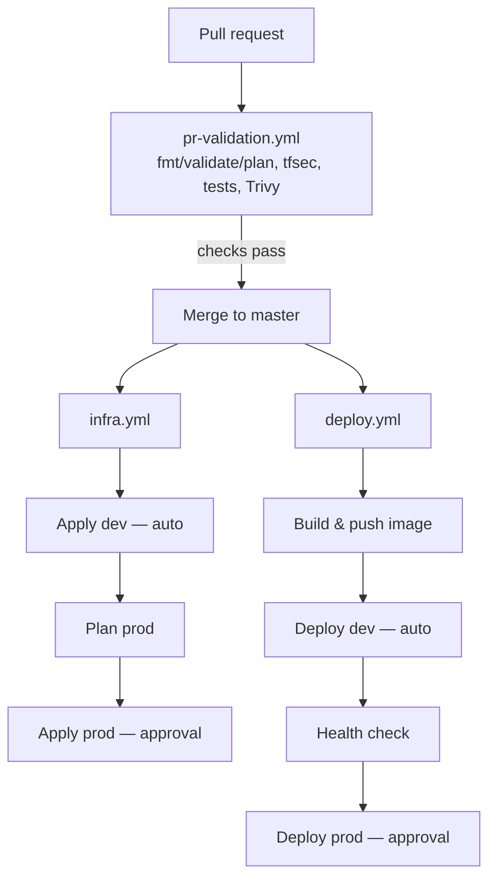

# CI/CD Pipeline Architecture

This document describes the three GitHub Actions workflows that make up this platform's CI/CD system, how they relate to each other, the identity/authentication model underpinning all of them, and the design decisions behind the current shape of the pipeline — including one decision that was deliberately reversed after implementation, and why.

## Contents

- [Overview](#overview)
- [Workflow 1: `pr-validation.yml`](#workflow-1-pr-validationyml)
- [Workflow 2: `infra.yml`](#workflow-2-infrayml)
- [Workflow 3: `deploy.yml`](#workflow-3-deployyml)
- [Identity model: GitHub OIDC federation](#identity-model-github-oidc-federation)
- [Why the three workflows are independent, not chained](#why-the-three-workflows-are-independent-not-chained)
- [Environment separation and approval gates](#environment-separation-and-approval-gates)
- [Required variables and fail-fast design](#required-variables-and-fail-fast-design)
- [End-to-end flow diagram](#end-to-end-flow-diagram)

---

## Overview

| Workflow | Trigger | Purpose | Identity used |
|---|---|---|---|
| `pr-validation.yml` | `pull_request` → `master` | Gate every merge: Terraform correctness, app tests, security scanning | `github_ci` (read-only) |
| `infra.yml` | `push` → `master`, `terraform/**` changed | Create/update AWS infrastructure | `terraform_apply` (dev, then prod) |
| `deploy.yml` | `push` → `master`, `app/**`/`Dockerfile` changed, or manual dispatch | Build, push, and deploy the application | `github_deploy` (dev, then prod) |

No workflow ever uses long-lived AWS credentials. All three authenticate via GitHub's native OIDC federation, exchanging a short-lived, per-job token for temporary AWS credentials scoped to exactly what that job needs.

---

## Workflow 1: `pr-validation.yml`

**Answers:** *"Is this change safe enough to merge?"*

Two jobs run in parallel on every pull request targeting `master`:

### Job: `terraform`
1. `terraform fmt -check -recursive` — formatting, repo-wide.
2. Assume the `github_ci` role (read-only) via OIDC.
3. `terraform init` / `validate` / `plan` against `terraform/environments/dev`. PRs always plan against dev — the prod plan is reviewed separately, later, in `infra.yml`, immediately before its own approval gate.
4. The plan is posted as a PR comment, **updated in place** on subsequent pushes (not a new comment per commit) via an idempotent `github-script` step that searches for a marker comment before deciding whether to create or update.
5. `tfsec` scans the whole `terraform/` tree for IaC security findings.

### Job: `application`
1. Install dependencies, lint (`ruff`), unit test (`pytest`).
2. `docker build` (build only — not pushed to any registry from this workflow).
3. `Trivy` scans the built image for `CRITICAL`/`HIGH` vulnerabilities, honoring `.trivyignore` for findings that are either genuinely unfixable upstream (documented, with an expiry date forcing periodic re-review) or confirmed false positives.

**Permissions are scoped per-job, not at the workflow level**: only the `terraform` job has `id-token: write` (needed for OIDC) and `pull-requests: write` (needed to post the plan comment). The `application` job never touches AWS or the PR API, so it never holds those permissions, even transiently.

**Branch protection** requires both jobs to pass before merge is permitted (configured via a GitHub ruleset, not in the workflow file itself — required status checks + "require a pull request before merging," with `Required approvals: 0` since this is currently a solo-maintained repository; production infrastructure and application deployments remain independently gated by GitHub Environment reviewers regardless — PR approval and deployment approval are intentionally separate controls, not the same gate wearing two hats).

---

## Workflow 2: `infra.yml`

**Answers:** *"Did infrastructure code change, and should AWS infrastructure be updated?"*

Triggers only on `terraform/**` (or its own file) changing on `master` — an application-only merge never touches this workflow at all.

```
apply-dev (auto)  →  plan-prod (unblocked)  →  apply-prod (gated on approval)
```

1. **`apply-dev`**: assumes `terraform_apply["dev"]`, runs `init`/`plan`/`apply` against `environments/dev`, using the GitHub Environment `infra-dev` (no required reviewers — dev is meant to move fast). Applies the exact plan just generated in the same job — never a second, potentially-different plan.
2. **`plan-prod`**: runs unblocked, immediately after `apply-dev` succeeds, so its output is visible in the job log *before* anyone is asked to approve anything. Uploads the plan as a build artifact.
3. **`apply-prod`**: gated behind the `infra-prod` GitHub Environment's required reviewers. Applies the *exact* plan artifact `plan-prod` produced — the approver is approving a specific, already-reviewed plan, not authorizing a fresh one to be generated after their click.

---

## Workflow 3: `deploy.yml`

**Answers:** *"Did the application change, and should we release a new image?"*

Triggers on `app/**`, `Dockerfile`, `.dockerignore`, or its own supporting files changing on `master` — or manually via `workflow_dispatch`, added specifically to allow on-demand testing without needing a throwaway code change and a full PR/merge cycle each time.

```
build-and-push  →  deploy-dev (auto)  →  deploy-prod (gated on approval)
```

1. **`build-and-push`**: builds the image once, tags it `sha-<12-char-commit>`, pushes to ECR. The image is deliberately generic — no `APP_ENV`/`APP_VERSION`/`BUILD_NUMBER`/`GIT_COMMIT` baked in at build time; those are injected as ECS task definition environment variables at deploy time instead, which is what makes it possible to promote the *same immutable ECR image tag* from dev to prod without ever rebuilding (tagged, not SHA-256-digest-pinned — ECR's `IMMUTABLE` tag-mutability setting is what makes that tag a reliable, un-overwritable reference).
2. **`deploy-dev`**: assumes `github_deploy["dev"]`, uses the `.github/actions/ecs-deploy` composite action to register a new task definition revision pointing at the freshly-pushed image and update the ECS service, then waits for the rollout to stabilize.
3. **End-to-end health check**: polls `GET /health` through the application's public HTTPS hostname (`finzla-dev.dglidestcl.com` / `finzla.dglidestcl.com`), exercising Route53 → ACM/TLS → ALB → ECS rather than contacting the task directly, for up to ~2.5 minutes. This is the exact path a real client's request takes, with genuine certificate validation — no `-k`/insecure flag needed. An earlier version of this check hit the ALB's raw AWS-assigned DNS name with `curl -k` instead; technically functional (and the reasoning for why that failed without `-k` is preserved in [`INCIDENT_REPORT.md`](./INCIDENT_REPORT.md)), but weaker evidence, since it never exercised DNS resolution or certificate validation the way a real customer's request does.
4. **Handling an unhealthy deployment**: two independent layers. First, the ECS service itself has `deployment_circuit_breaker { enable = true, rollback = true }` configured in Terraform — if new tasks fail their own container-level health checks, ECS stops the rollout and reverts to the last healthy task definition automatically, no human or pipeline action required. Second, if the health check polling loop still doesn't see a `200` (e.g. the rollback itself is unhealthy, or the ALB hasn't caught up yet), the job fails loudly and `deploy-prod` never runs, since it depends on `deploy-dev` succeeding.
5. **`deploy-prod`**: identical shape to `deploy-dev`, gated behind the `production` GitHub Environment's required reviewers — a separate approval boundary from `infra-prod` (see below).

---

## Identity model: GitHub OIDC federation

No workflow stores or uses a long-lived AWS access key. Every AWS interaction is authenticated via a token GitHub issues fresh for that specific job, exchanged for temporary AWS credentials by `aws-actions/configure-aws-credentials`. Five distinct IAM roles exist, each scoped as narrowly as the job that assumes it actually requires:

| Role | Assumed by | Trust condition | Can do |
|---|---|---|---|
| `github_ci` | `pr-validation.yml` | any ref/PR in this exact repo (`StringLike`, wildcard) | Read-only `Describe`/`List`/`Get` across the AWS services this stack touches. Cannot create, modify, or delete anything. |
| `terraform_apply["dev"]` | `infra.yml`, `apply-dev` job | `environment: infra-dev` (`StringEquals`, exact) | Full create/update/delete on dev's infrastructure, scoped to the `finzla-*` naming prefix wherever AWS's IAM model allows resource-level scoping. |
| `terraform_apply["prod"]` | `infra.yml`, `apply-prod`/`plan-prod` jobs | `environment: infra-prod` | Same, for prod. **Note:** `plan-prod` currently assumes this same write-capable role, unblocked, before `apply-prod`'s approval gate — it only ever runs `terraform plan` in practice, but the credential itself is not scoped to read-only the way `github_ci`'s is. A stricter design would give `plan-prod` a separate, genuinely read-only role (mirroring `github_ci`'s scope) and reserve this role exclusively for the approval-gated `apply-prod` job. Not implemented here due to time constraints; flagged as a concrete, specific hardening item rather than left implicit. |
| `github_deploy["dev"]` | `deploy.yml`, `build-and-push`/`deploy-dev` jobs | `environment: development` | Push to one named ECR repository, update one named ECS service, `PassRole` exactly two task roles. Cannot touch IAM, networking, or any other service. |
| `github_deploy["prod"]` | `deploy.yml`, `deploy-prod` job | `environment: production` | Same, for prod. |

Every trust policy's `sub` condition uses the account's actual observed OIDC subject format — `repo:ORG@ORG_ID/REPO@REPO_ID:...` — established by the incident documented in [`INCIDENT_REPORT.md`](./INCIDENT_REPORT.md).

`terraform_apply` is the single most powerful role in the account, since Terraform must be able to manage IAM roles/policies as ordinary resources — including its own sibling roles. This is an inherent, not-fully-eliminable risk of any "Terraform manages its own IAM" design; what bounds it here is detailed in the README's Security section (resource-name-prefix scoping, narrow OIDC trust, no standing credential, mandatory plan review before every apply).

---

## Why the three workflows are independent, not chained

An earlier iteration of this pipeline had `deploy.yml` triggered by `infra.yml`'s completion (via `workflow_run`), on the reasoning that an application should never deploy on top of unverified infrastructure. This was deliberately reverted.

**The trade-off that motivated the revert**: chaining the workflows meant `infra-dev.yml` had to run on *every* push (not just infra changes) to reliably trigger the downstream deploy — a full `terraform plan`/`apply` cycle on every trivial app-only commit, purely to keep the chain functioning. It also introduced real `workflow_run` mechanics that are harder to reason about (SHA-pinning caveats, a run that doesn't show up as a normal PR status check, cross-workflow debugging when something goes wrong) for a safety guarantee this project's actual scale doesn't need day-to-day.

**What replaced it**: the two pipelines are fully independent, each triggered only by its own path filter. The safety property — infra and app changes never racing into an inconsistent state — is now a **documented PR convention**, not a technical guarantee: infrastructure PRs and application PRs are kept separate, particularly for the very first deployment into a given environment, so `deploy.yml` is never the first thing attempting to deploy into infrastructure that doesn't exist yet.

This is a conscious trade of a weaker (process-based) guarantee for meaningfully less system complexity — consistent with the assessment's own stated principle that a smaller, well-understood solution scores higher than an unnecessarily complex one. The condition under which this trade-off should be revisited is explicit: if this repository ever gains a second contributor, process-based discipline alone becomes materially less reliable, and re-introducing an explicit technical dependency between the two pipelines would be the correct next step at that point.

---

## Environment separation and approval gates

Four GitHub Environments exist, deliberately split along two independent axes:

|  | Auto (no gate) | Requires approval |
|---|---|---|
| **Infrastructure** (`infra.yml`) | `infra-dev` | `infra-prod` |
| **Application** (`deploy.yml`) | `development` | `production` |

Infra approvers and app-deploy approvers are not required to be the same people — `infra-prod` and `production` are separate approval boundaries with independently configurable reviewers. This matters once a platform team and an application team are not the same group of people, even though this repository currently has a single maintainer for both.

A pending `infra-prod` approval can never block an app deploy (the two pipelines don't depend on each other at all — see above), and conversely a pending `production` app-deploy approval never blocks an infrastructure change.

---

## Required variables and fail-fast design

Both `pr-validation.yml` and `infra.yml` run `terraform plan`/`apply` in a non-interactive CI environment with no `terraform.tfvars` file (that file is gitignored — it only ever exists on a human's machine). Several Terraform variables (`github_org`, `github_org_id`, `github_repo_id`, `alarm_email`) have no default value and must be supplied some other way, or Terraform falls back to an interactive input prompt — which a CI runner can never answer.

This is not hypothetical: exactly this happened once, causing a job to hang for roughly two hours before manual cancellation, having already acquired (and never released) the Terraform state lock. The orphaned lock then blocked every subsequent `terraform` operation until manually cleared.

**The fix has two independent layers**, deliberately redundant:

1. **Supply every required variable explicitly.** All four values are sourced from GitHub Actions repository *Variables* (not Secrets — none of them are sensitive) via `TF_VAR_*` environment variables at the workflow level:
   ```yaml
   env:
     TF_VAR_github_org: ${{ vars.GH_ORG }}
     TF_VAR_github_org_id: ${{ vars.GH_ORG_ID }}
     TF_VAR_github_repo_id: ${{ vars.GH_REPO_ID }}
     TF_VAR_alarm_email: ${{ vars.ALARM_EMAIL }}
   ```
2. **`-input=false` on every `terraform init`/`plan`/`apply` call**, as a second line of defense. If a future variable is ever added without a default and without a matching `TF_VAR_*`/`vars` entry, this makes Terraform fail immediately with a clear "no value for required variable" error — in seconds, not hours — instead of silently falling back to a prompt no one is present to answer.

---

## End-to-end flow diagram



The two branches below `MERGE` are deliberately independent (see above) — the diagram's parallel structure reflects that they can, and normally do, run without any relationship to each other, converging only in the sense that `deploy.yml` requires infrastructure to already exist, which is a documented PR-ordering convention rather than a runtime dependency.